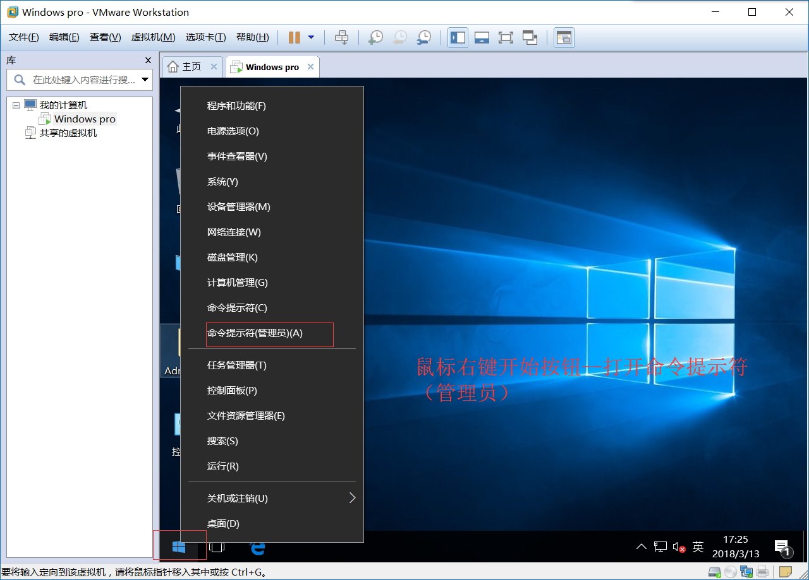
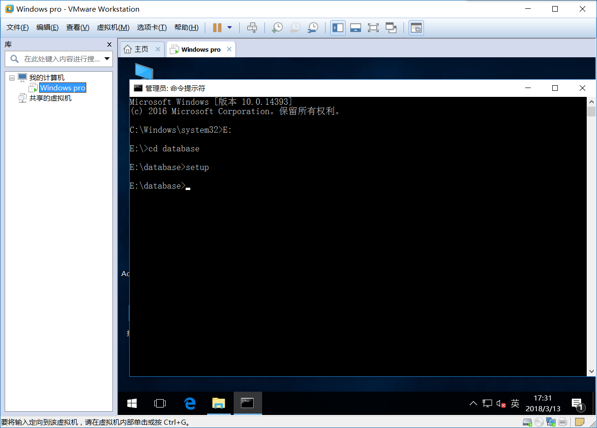
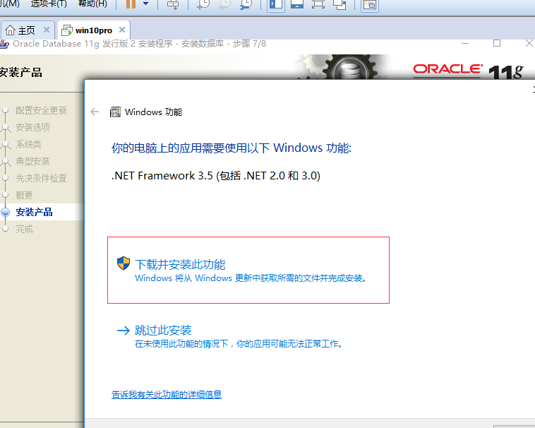

#oracle
----
网站：www.oracle.com/cn/index.html
====
#1

#2

#3

#4
#5
#6
#7
#8
#9
#10
#11
#12
#13
#14
#15
#16
#17
#18
#19
#20
#21
#22
#23
#24  
#25 
#26
#27
#28
#29 
#30 
#31
#32
#33
#34
#35
#36
#37
#38
#39

登陆oracle：默认em是打开的https//local host：1158/em/  可以使用system+密码（自己设的）进行登录。
==